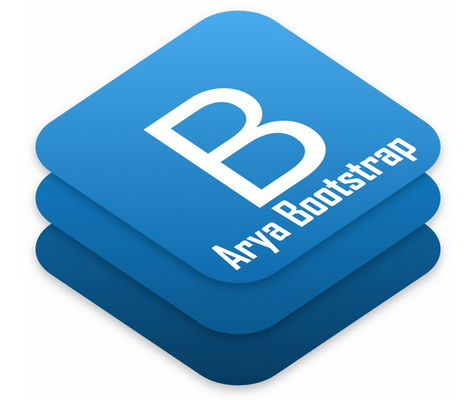

# AryaBootstrap
### AryaBootstrap is a bootstrap with dual layout align support and, used for LTR and RTL web design.
Based on Bootstrap Ver 4.3.1 - Read English Version [ReadMe.EN.md](https://github.com/mRizvandi/AryaBootstrap-4.3.1/blob/master/ReadMe.En.md)

<div dir="RTL" align="right" style="direction:rtl;text-align:right;">

# آریا بوت استرپ
### آریا بوت استرپ کتابخانه بوت استرپ دوگانه چپ چین و راست چین است
این نسخه از آریا بوت استرپ بر پایه نسخه 4.3.1 بوت استرپ پیاده سازی شده است.

</div>



<div dir="RTL" align="right" style="direction:rtl;text-align:right;">

### با بهره گیری از کتابخانه آریا بوت استرپ، پروژه های نسخه موبایل، واکنشگرا برای وب طراحی کنید.

آریا بوت استرپ، یک ابزرا *رایگان* برای توسعه وب سایت ها است که از اچ تی ام ال، استایل و جاوا اسکریپت تشکیل شده است. می توانید به سرعت نمونه اولیه یا برنامه خود را با استفاده از الگوها و نمونه های طراحی شده توسعه دهید. این نسخه از آریا بوت استرپ بر مبنای نسخه 4.0.0 بوت استرپ ایجاد شده است. بنابراین تمام قابلیتهای بوت استرپ در این کتابخانه مهیا است. 

### راه اندازی

> توضیحات کامل در سایت [آریا بوت استرپ](http://abs.aryavandidad.com/fa-ir/getstarted) آمده است.
> همچنین می توانید نمونه سایت و تمامی کامپوننتهای بوت استرپ در محیط راست چین را در سایت آریا بوت استرپ مشاهده کنید.

راه اندازی آریا بوت استرپ به همان سادگی راه اندازی بوت استرپ است.

#### 1. برای شروع، فایلهای آریا بوت استرپ را از [گیت هاب](http://github.com/mRizvandi/AryaBootstrap-4.3.1) دانلود کنید.

پس از دانلود، فایلها را از حالت فشرده خارج نمایید، پس از این عمل پوشه های css و js را به مسیر پروژه خود کپی کنید.

دقت نمایید که در نسخه کامل، فایلهای مورد نیاز بوت استرپ نیز در فایل دانلود شده قرار دارد و نیازی به دانلود آنها نیست.

#### 2. اضافه کردن فایل استایل

پس از اضافه نمودن فایلها به پروژه ابتدا، فایل css را به صفحه، صفحات یا الگوی خود اضافه کنید.

</div>

```
<link rel="stylesheet" type="text/css" href="css/bootstrap.min.css" /> 
```

<div dir="RTL" align="right" style="direction:rtl;text-align:right;">

#### 3. اضافه کردن فایلهای جاوا اسکریپت

با توجه به اینکه برخی از کامپوننتهای بوت استرپ نیازمند کدهای جاوا اسکریپت هستند، لازم است فایل جاوا اسکریپت بوت استرپ به صفحه اضافه شود.

دقت کنید که بوت استرپ بر پایه کتابخانه jQuery پیاده سازی شده و برای سیستم گرید خود نیازمند کتابخانه popper.js است. بنابراین لازم است پیش از معرفی فایل جاوا اسکریپت بوت استرپ، نیازمندهای آن معرفی گردند.

می توانید از CDN یا فایلهای دانلود شده استفاده نماید. 

</div>

```
<script type="text/javascript" src="js/jquery.slim.min.js"></script>
<script type="text/javascript" src="js/popper.min.js"></script>
<script type="text/javascript" src="js/bootstrap.min.js"></script>
```

<div dir="RTL" align="right" style="direction:rtl;text-align:right;">

#### 4. اضافه کردن خصوصیت dir به html
بسیار خوب، اضافه کردن خصوصیت dir برای تعیین وضعیت چیدمان صفحه به تگ html آخرین کاری است که باید انجام دهید:

</div>

```
<html dir="rtl">
```

<div dir="RTL" align="right" style="direction:rtl;text-align:right;">

### اطلاعات بیشتر در سایت آریا بوت استرپ
همه آنچه که نیاز بود انجام شده است، حالا می توانید صفحات خود را بر مبنای آریا بوت استرپ طراحی کنید. 

برای اطلاعات بیشتر و مشاهده نمونه کامپوننتهای راست چین به آدرس وب سایت اختصاصی آریا بوت استرپ مراجعه کنید:

وب سایت [آریا بوت استرپ](http://abs.aryavandidad.com)

</div>
