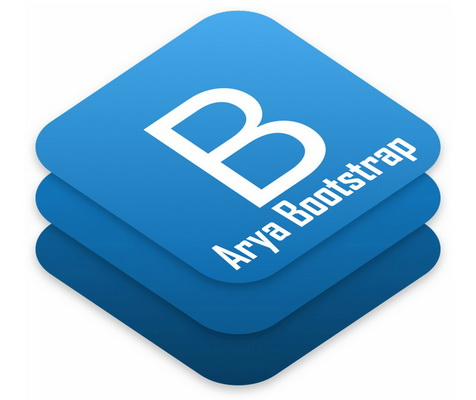

# AryaBootstrap
### AryaBootstrap is a bootstrap with dual layout align support and, used for LTR and RTL web design.
Based on Bootstrap Ver 4.3.1



### Build responsive, mobile-first projects on the web with the world’s most popular front-end component library.

AryaBootstrap is an open source toolkit for developing with HTML, CSS, and JS. Quickly prototype your ideas or build your entire app with our templates, responsive grid system, extensive prebuilt components, and powerful plugins built on jQuery. This Version of AryaBootstrap is based on Bootstrap Ver 4.3.1 and all bootstrap feature is provided.

### Installation

Installation AryaBootstrap is as simple as Bootstrap.

#### 1. First of all, Download the github AryaBootstrap repository، [GitHub](http://github.com/mRizvandi/AryaBootstrap).

Extract the files and folders, copy Css and Js folders to your project.

#### 2. Add Css file to your pages

Add Css file link to your page like the below HTML code:

```
<link rel="stylesheet" type="text/css" href="css/bootstrap.min.css" /> 
```

#### 3. Add Js files to your page

Some bootstrap components need bootstrap.js for doing well on the page. and they used jQuery library. so you have to add jQuery (slim version is enuogh) file before add bootstrap js file.

Bootstrap used popper.js to provide grid system and you have to add popper.js after jQuery file.

At the end, you have to add Bootstrap.js

```
<script type="text/javascript" src="js/jquery.slim.min.js"></script>
<script type="text/javascript" src="js/popper.min.js"></script>
<script type="text/javascript" src="js/bootstrap.min.js"></script>
```

Also, you can use the bootstrap CDN files insted use of downloaded files:

```
<script src="https://code.jquery.com/jquery-3.3.1.slim.min.js" integrity="sha384-q8i/X+965DzO0rT7abK41JStQIAqVgRVzpbzo5smXKp4YfRvH+8abtTE1Pi6jizo" crossorigin="anonymous"></script>
<script src="https://cdnjs.cloudflare.com/ajax/libs/popper.js/1.14.7/umd/popper.min.js" integrity="sha384-UO2eT0CpHqdSJQ6hJty5KVphtPhzWj9WO1clHTMGa3JDZwrnQq4sF86dIHNDz0W1" crossorigin="anonymous"></script>
<script src="https://stackpath.bootstrapcdn.com/bootstrap/4.3.1/js/bootstrap.min.js" integrity="sha384-JjSmVgyd0p3pXB1rRibZUAYoIIy6OrQ6VrjIEaFf/nJGzIxFDsf4x0xIM+B07jRM" crossorigin="anonymous"></script>
```

#### 4. Latest and Important Step

Add "dir" property to your "html" tag. use **dir="rtl"** for RTL layout and **dir="ltr"** for LTR layout.

```
<html dir="rtl">
```

**Everything is Done!** run your project and enjoy the rtl bootstrap.

Check the AryaBootstrap Website, there are some sample and articles (Persian Version).

### [AryaBootstrap Website](http://abs.aryavandidad.com)

#### Persian Version is also avilable at [Persian ReadMe](https://github.com/mRizvandi/AryaBootstrap/blob/master/README.md)
